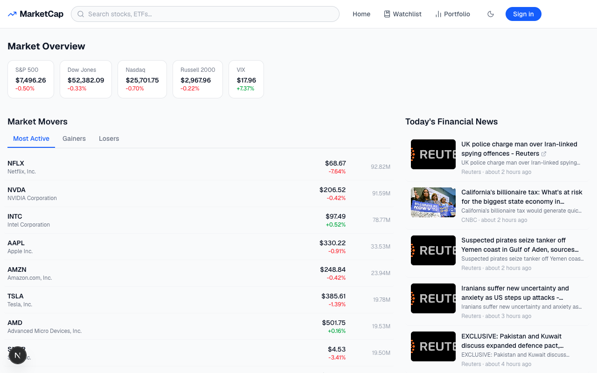
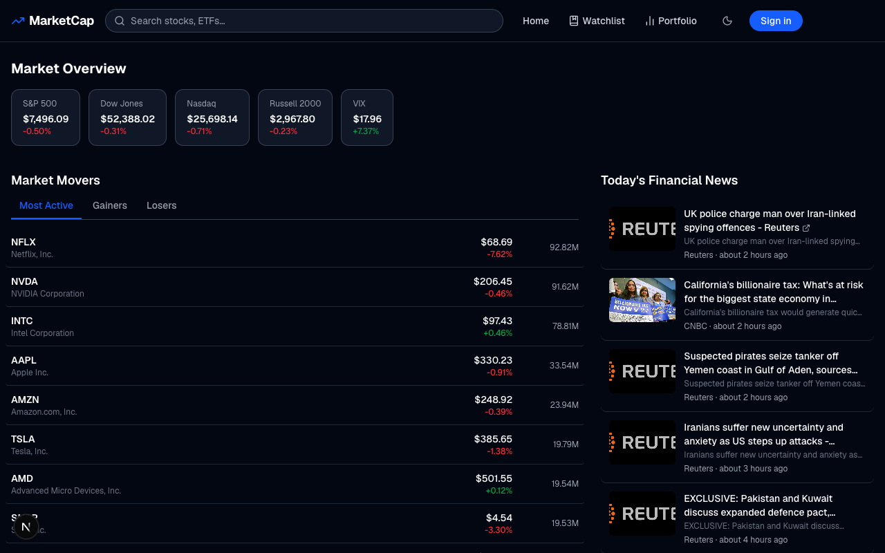
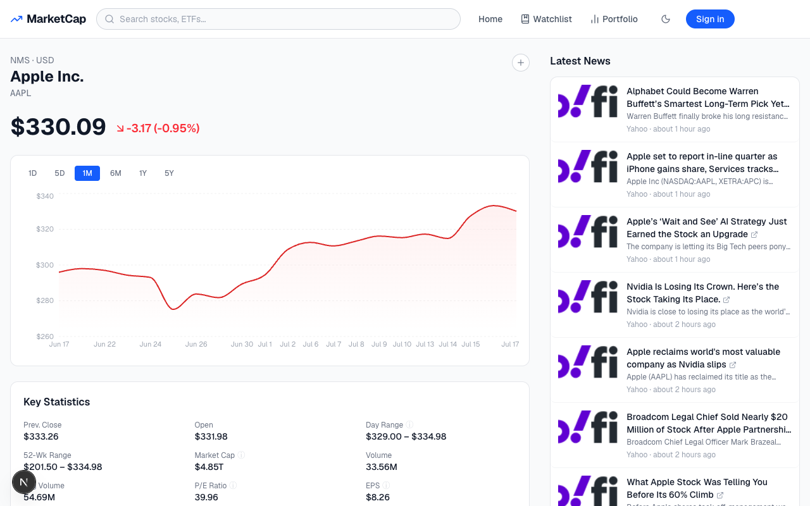
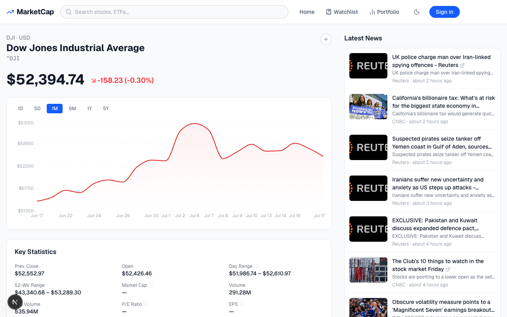
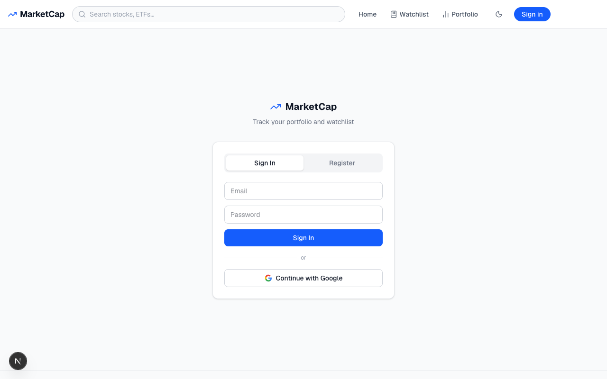
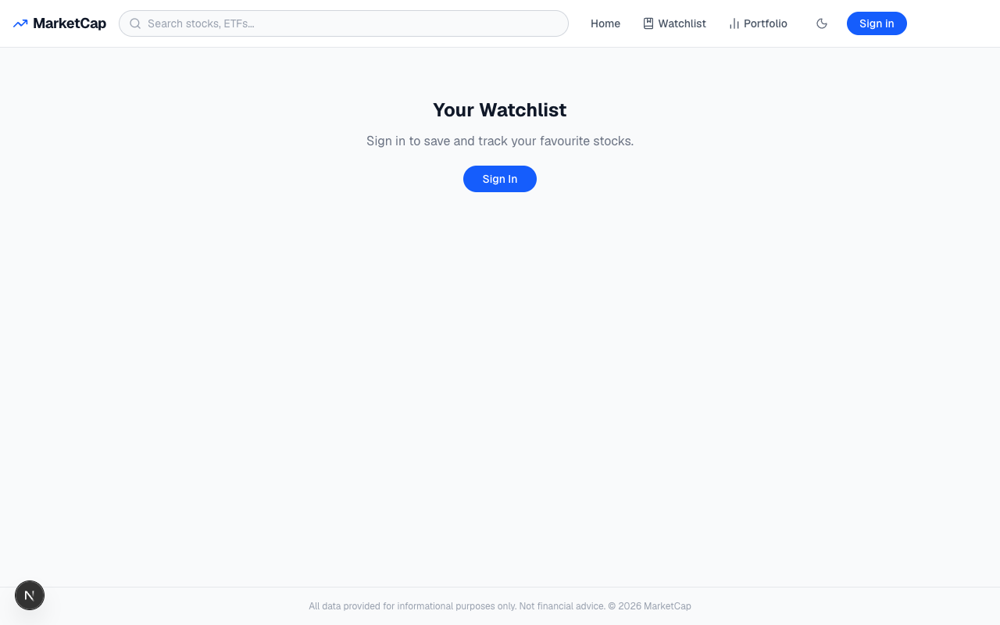
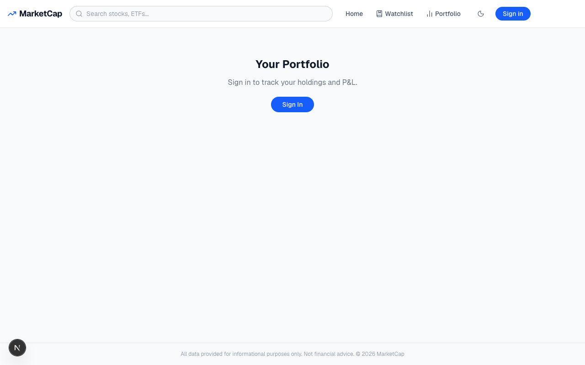

# MarketCap

A Google Finance-style stock investment web app built with Next.js, TypeScript, and Tailwind CSS. Track live (delayed) stock prices, read financial news, manage a personal watchlist, and monitor your portfolio — all in one place.

**Live app:** https://marketcap-woad.vercel.app &nbsp;·&nbsp; **[Architecture docs](ARCHITECTURE.md)**

---

## Screenshots

### Homepage — Market Overview


The homepage displays real-time market indices (S&P 500, Dow Jones, Nasdaq, Russell 2000, VIX), a Market Movers table with tabs for Most Active, Gainers, and Losers, a Trending Stocks strip, and a live financial news feed powered by Finnhub.

---

### Dark Mode


Toggle between light and dark themes using the moon/sun icon in the navbar. The preference is saved to `localStorage` and persists across sessions.

---

### Stock Detail Page


Clicking any stock opens a detail page with an interactive price chart (1D / 5D / 1M / 6M / 1Y / 5Y time ranges), key statistics (market cap, P/E ratio, 52-week range, volume, EPS, dividend yield), a company description with sector/industry/employee info, and a stock-specific news sidebar.

---

### Index Detail Page


Market indices like the Dow Jones Industrial Average have their own detail pages with full price history charts and general market news.

---

### Sign In


Users can sign in with Google OAuth or with an email and password. New accounts can be created via the Sign Up flow. Authentication is powered by NextAuth v5 with a Supabase PostgreSQL backend.

---

### Watchlist


Authenticated users can save stocks to a personal watchlist from any stock card or detail page. The watchlist page shows live prices and daily change for all saved tickers.

---

### Portfolio Tracker


Track your holdings by entering a ticker, number of shares, and purchase price. The portfolio page calculates current value and unrealised P&L per position.

---

## Tech Stack

| Layer | Technology |
|---|---|
| Framework | Next.js 16 (App Router) + TypeScript |
| Styling | Tailwind CSS v4 |
| Auth | NextAuth v5 (Google OAuth + email/password) |
| Database | Supabase PostgreSQL + Prisma ORM |
| Stock Data | yahoo-finance2 (delayed quotes, history, search) |
| News | Finnhub API (free tier) |
| Charts | Recharts |
| Deployment | Vercel |

---

## Getting Started

1. Clone the repo and install dependencies:
   ```bash
   git clone https://github.com/thenugespeaks/marketcap.git
   cd marketcap
   npm install
   ```

2. Copy `.env.example` to `.env` and fill in your credentials:
   ```bash
   cp .env.example .env
   ```

3. Run the Prisma migration against your database:
   ```bash
   npx prisma migrate dev --name init
   ```

4. Start the dev server:
   ```bash
   npm run dev -- --webpack
   ```

Open [http://localhost:3000](http://localhost:3000).
